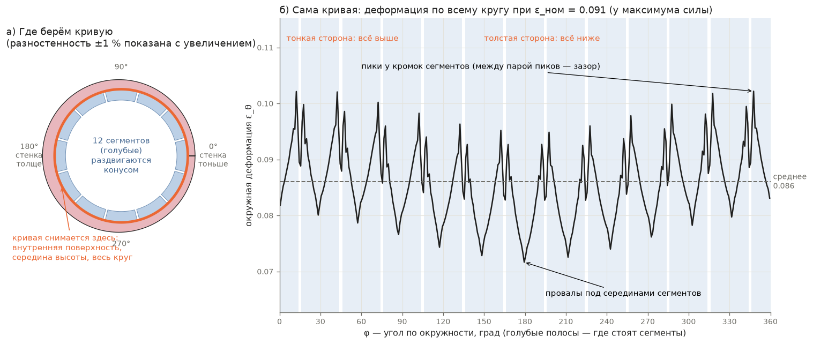
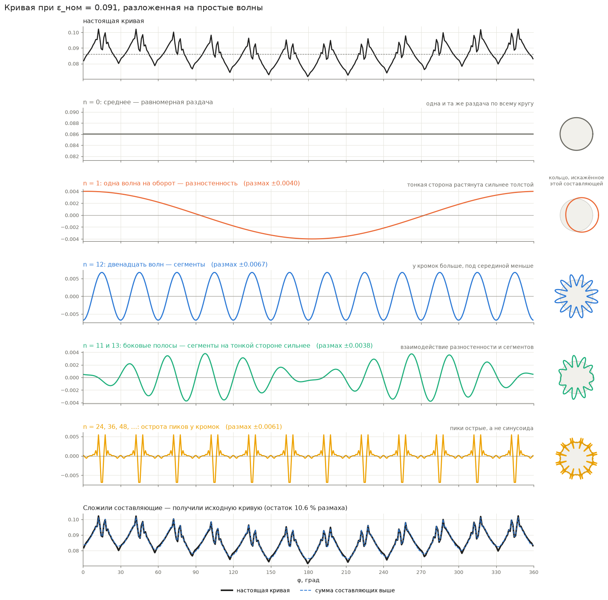
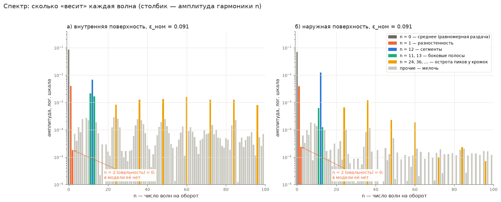
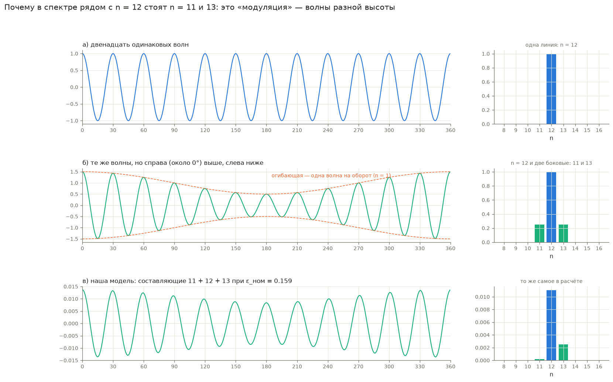
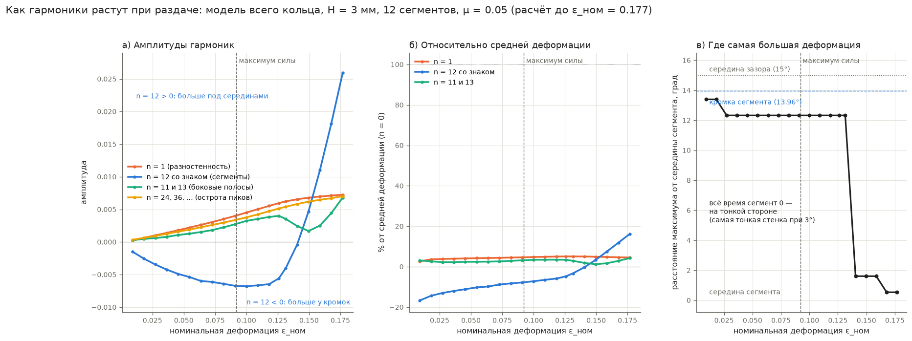
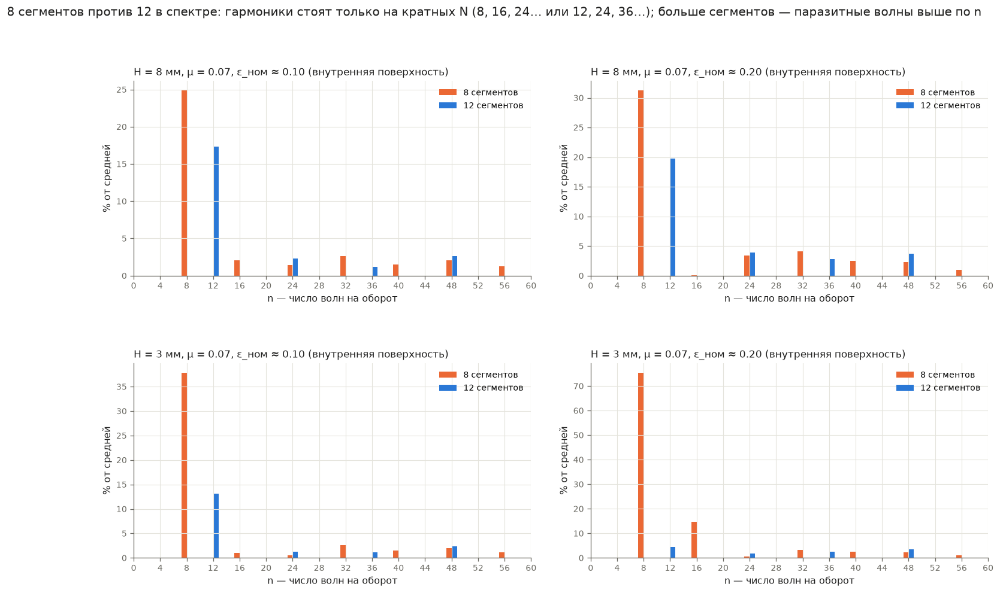
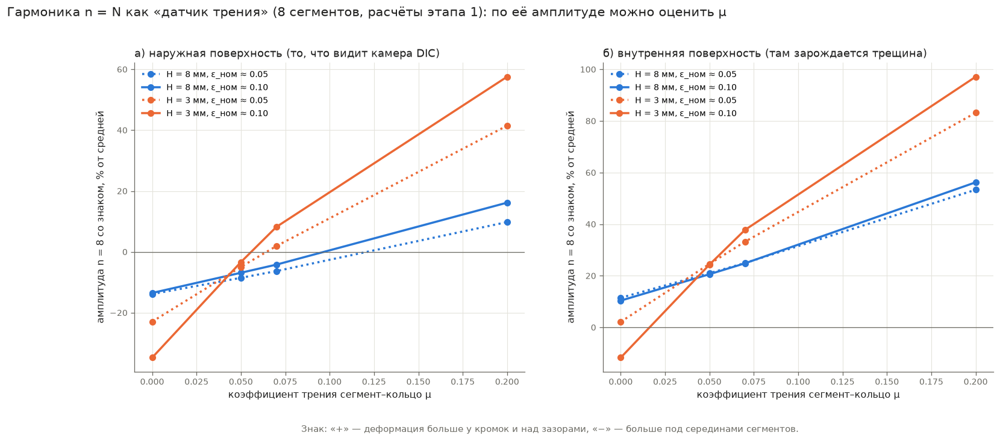
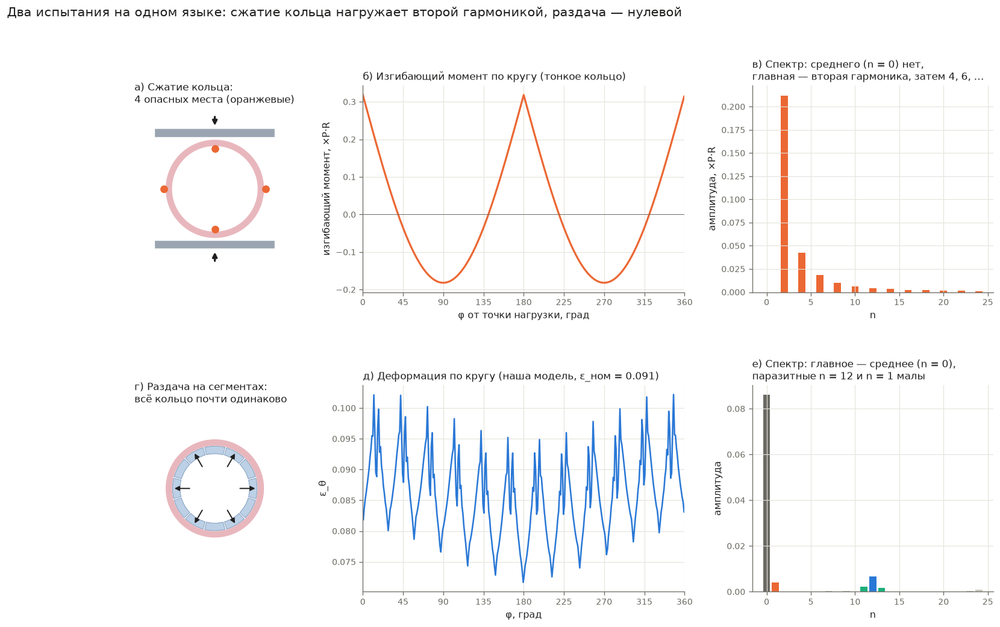
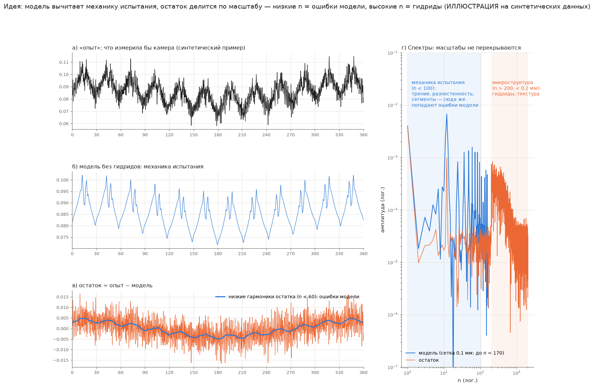

# Деформация кольца как сумма простых волн: что это, что показывает и как применить

## Коротко

**Что сделано.** Деформацию кольца по окружности (одну кривую — по всему кругу) разложили на простые волны: «одна волна на оборот», «двенадцать волн на оборот» и так далее. Это называется гармоническим анализом, или разложением в ряд Фурье. Кольцо замкнуто, любая величина на нём повторяется через 360°, поэтому такое разложение для кольца естественно.

**Что оказалось.** У каждой причины неравномерности — своя волна, и они не смешиваются:

- **одна волна на оборот** (n = 1) — разностенность трубы;
- **двенадцать волн** (n = 12) — сегменты оправки, по волне на сегмент;
- **11 и 13 волн** — взаимодействие этих двух причин: сегменты на тонкой стороне нагружены сильнее;
- **среднее** (n = 0) — полезная равномерная раздача.

**Что это даёт.** Видно, какая причина сколько «весит» и как это меняется при нагружении. По этим волнам видно, какой сегмент кольцо «выбирает» для шейки и где внутри сегмента. В модели всего кольца шейка пошла в середину сегмента на тонкой стороне. Ещё из этого следуют практические вещи: оценка трения по измеренной деформации, критерий годности испытания, ориентация кольца по замеру толщины стенки. И путь к тому, чтобы отделить вклад гидридов от вклада самого испытания.

**Ново ли это.** Метод классический. Его применение к испытанию на сегментной оправке и к влиянию гидридов, похоже, новое, но это надо подтвердить обзором литературы (раздел 12).

## Что за кривая

Возьмём кольцо на оправке из 12 сегментов (модель всего кольца: высота 3 мм, трение μ = 0.05). Пройдём по внутренней поверхности посередине высоты по всему кругу и в каждой точке запишем, насколько материал растянут по окружности (ε_θ). Получится кривая: по горизонтали угол φ от 0 до 360°, по вертикали деформация.

*Рис. 1. а) Кривая снимается по внутренней поверхности посередине высоты; стенка чуть тоньше справа (φ ≈ 0°) и толще слева (180°), разница ±1 % (на схеме увеличена). б) Деформация по кругу при номинальной деформации ε_ном = 0.091, у максимума силы. Голубые полосы — где стоят сегменты.*

На кривой видно три вещи сразу:

1. **Средний уровень** около 0.086 — кольцо в целом раздали на столько.
2. **Двенадцать одинаковых узоров** — по одному на сегмент. У кромок сегмента деформация больше (пики), под серединой сегмента меньше (провалы), над зазором между парой пиков — небольшой провал.
3. **Медленный наклон всего узора:** справа, на тонкой стороне, всё чуть выше, слева, на толстой, — чуть ниже.

Задача — разделить эти три вещи и измерить каждую отдельно.

## Идея: любую кривую на кольце можно сложить из простых волн

Аналогия — звук. Аккорд на пианино — одна сложная звуковая волна. Но её можно разложить на отдельные ноты, и про каждую сказать, насколько громко она звучит. Набор «нота → громкость» называется спектром.

С кривой на кольце то же самое. «Ноты» здесь — простые волны вида «n волн на оборот»:

- n = 0 — просто постоянный уровень;
- n = 1 — одна плавная волна на весь круг: одна сторона выше, противоположная ниже;
- n = 2 — две волны: так выглядит овал;
- n = 12 — двенадцать волн;
- и так далее.

Любую кривую на кольце можно точно сложить из таких волн, если взять каждую нужной высоты (амплитуды) и правильно сдвинуть. Найти эти амплитуды — и есть разложение. Компьютер делает это мгновенно (быстрое преобразование Фурье).

*Рис. 2. Сверху — настоящая кривая. Ниже — её составляющие: среднее (n = 0), одна волна (n = 1), двенадцать волн (n = 12), боковые полосы (n = 11 и 13), острота пиков (n = 24, 36, 48, …). Справа — как выглядело бы кольцо, искажённое только этой составляющей: n = 1 — сдвинутый круг, n = 12 — «цветок» из 12 лепестков. Внизу — сумма составляющих почти совпадает с исходной кривой.*

Как читать рис. 2:

- **n = 0** — 0.086: это и есть «полезная» часть испытания, одинаковая по всему кругу.
- **n = 1** — плавная волна размахом ±0.004: тонкая сторона растянута сильнее толстой. Это разностенность всего ±1 %, а разница деформаций — около ±5 % от средней.
- **n = 12** — двенадцать волн размахом ±0.007: это сегменты.
- **n = 11 и 13** — волны, которые выше на тонкой стороне и ниже на толстой (раздел 5).
- **n = 24, 36, …** — нужны, чтобы сделать пики у кромок острыми: одна синусоида с 12 волнами слишком плавная.

## Спектр: какая волна что означает

Если нарисовать амплитуду каждой волны столбиком, получится спектр. Высокий столбик — эта волна в кривой сильна, низкий — почти отсутствует.

*Рис. 3. Спектр той же кривой (ε_ном = 0.091) на внутренней и наружной поверхности. Шкала логарифмическая: каждая линия сетки — в 10 раз. Цвет — физическая причина.*

| Волна | Что означает | Откуда берётся |
|---|---|---|
| n = 0 | средняя деформация | раздача кольца конусом |
| n = 1 | одна сторона больше другой | разностенность трубы; в опыте ещё несоосность конуса |
| n = 2 | овал | овальность кольца (в модели её нет — столбик почти нулевой, это проверка) |
| n = N (у нас 12) | по волне на сегмент | сегменты: изгиб кольца у кромок и над зазорами, трение |
| n = 2N, 3N, … | форма волны сегмента | пики у кромок острые, не синусоида |
| n = N ± 1 | волны сегментов разной высоты | взаимодействие разностенности и сегментов |
| остальные | мелочь | численный «шум» модели |

Наружная поверхность отличается от внутренней. На ней волна сегментов (n = 12) сильнее, а острые пики (24, 36, …) слабее. Причина — изгиб. Над зазором кольцо выпрямляется: внутренняя сторона стенки удлиняется, наружная укорачивается. Поэтому на внутренней поверхности деформация больше у кромок, а на наружной — под серединой сегмента.

## Боковые полосы: волны разной высоты

Почему рядом с n = 12 появляются n = 11 и n = 13? Это известное явление — модуляция. В радио так передают звук (амплитудная модуляция, AM): высокая «несущая» частота меняет свою громкость в такт медленному сигналу.

*Рис. 4. а) Двенадцать одинаковых волн — в спектре одна линия n = 12. б) Те же волны, но выше справа и ниже слева (огибающая — одна волна на оборот): в спектре появляются две боковые линии, n = 11 и n = 13. в) То же в нашей модели (составляющие 11 + 12 + 13): волны сегментов на тонкой стороне (около 0°) выше, чем на толстой (около 180°).*

Математически это простое тождество: волна с 12 периодами, умноженная на «одна волна на оборот», равна сумме волн с 11 и 13 периодами. Поэтому **боковые полосы — это след взаимодействия**: сегменты на тонкой стороне работают сильнее, чем на толстой.

В модели боковые полосы не совсем равны (n = 13 больше n = 11). Значит, волны сегментов на тонкой стороне не только выше, но и чуть сдвинуты по углу. Это уже тонкости.

## Что происходит при нагружении

Самое интересное — как амплитуды меняются по мере раздачи.

*Рис. 5. Модель всего кольца (H = 3 мм, 12 сегментов, μ = 0.05, разностенность ±1 %), расчёт ещё идёт — показано до ε_ном = 0.177. а) Амплитуды; волна сегментов показана со знаком: «−» — деформация больше у кромок, «+» — под серединами сегментов. б) Те же амплитуды в процентах от средней деформации. в) Где самая большая деформация — расстояние от середины сегмента.*

История по шагам:

1. **До максимума силы** (ε_ном < 0.09) все волны растут вместе со средней. Волна сегментов отрицательная: деформация больше у кромок. Самое нагруженное место — кромки сегмента 0 на тонкой стороне.
2. **После максимума силы** волна сегментов перестаёт расти, а разностенность (n = 1) и боковые полосы продолжают. Кольцо начинает «выбирать»: сегменты на тонкой стороне отрываются от остальных.
3. **Около ε_ном ≈ 0.14 волна сегментов проходит через ноль и меняет знак.** До этого деформация была больше у кромок, теперь — под серединами сегментов. Самое нагруженное место прыгает с кромки сегмента 0 в его середину (рис. 5в) — рядом с самым тонким местом стенки (3°).
4. **Дальше середина сегмента 0 быстро уходит вперёд.** При ε_ном = 0.177 там ε_θ = 0.29 при средней 0.16. Это начинающаяся шейка.

| ε_ном | среднее | n = 1, % от средней | n = 12 (со знаком) | n = 11 / 13 | наибольшая ε_θ |
|---|---|---|---|---|---|
| 0.018 | 0.018 | 3.6 | −0.0026 | 0.0004 / 0.0003 | 0.022 |
| 0.091 | 0.086 | 4.6 | −0.0067 | 0.0022 / 0.0017 | 0.102 |
| 0.118 | 0.111 | 5.0 | −0.0065 | 0.0032 / 0.0021 | 0.131 |
| 0.141 | 0.130 | 5.0 | −0.0004 | 0.0024 / 0.0005 | 0.166 |
| 0.177 | 0.160 | 4.5 | +0.0259 | 0.0029 / 0.0061 | 0.290 |

**Что это значит.** Разностенность в ±1 % решила, какой из 12 сегментов сработает. Механика сегмента решила, где внутри него: сначала у кромки, затем — в середине. Без разложения это видно только по картам глазом. Со спектром — по нескольким числам, и раньше, чем глазом: боковые полосы начинают расти уже до максимума силы.

Секторная модель с симметрией тоже предсказывала переход шейки в середину сегмента, но позже (при ε_ном ≈ 0.26). В ней одинаковые шейки растут сразу у всех сегментов и мешают друг другу. В модели всего кольца шейка одна и растёт быстрее.

## 8 или 12 сегментов на языке спектра

У оправки с N одинаковыми сегментами возмущения стоят только на волнах, кратных N: 8, 16, 24, … или 12, 24, 36, …. Чем больше сегментов, тем выше по номеру уходят «паразитные» волны и тем они слабее.

*Рис. 6. Спектры деформации внутренней поверхности для 8 и 12 сегментов (секторные модели, μ = 0.07) при ε_ном ≈ 0.10 и 0.20. Высота столбика — в процентах от средней деформации.*

| | 8 сегментов: n = 8 | 12 сегментов: n = 12 |
|---|---|---|
| H = 8 мм, ε_ном ≈ 0.10 | 25 % | 17 % |
| H = 8 мм, ε_ном ≈ 0.20 | 31 % | 20 % |
| H = 3 мм, ε_ном ≈ 0.10 | 38 % | 13 % |
| H = 3 мм, ε_ном ≈ 0.20 | 76 % (плюс 15 % на n = 16) | 4 % |

То же, что и в прошлом сравнении (`nseg_check.md`), но одним числом. Для H = 8 мм переход на 12 сегментов снижает паразитную волну на треть. Для H = 3 мм — в 3–17 раз: с 8 сегментами низкое кольцо при ε_ном ≈ 0.20 уже сильно локализовано над зазорами (76 %).

## Волна сегментов как «датчик трения»

Чем больше трение между сегментами и кольцом, тем сильнее кольцо «держится» под серединой сегмента и тем больше растягивается у кромок. Значит, амплитуда волны n = N зависит от трения. Если её измерить, можно оценить μ.

*Рис. 7. Амплитуда волны n = 8 (8 сегментов, расчёты этапа 1) в зависимости от μ, со знаком: «+» — деформация больше у кромок и над зазорами, «−» — под серединами сегментов. а) Наружная поверхность — её видит камера при цифровой корреляции изображений (DIC). б) Внутренняя поверхность.*

Амплитуда волны n = 8 при ε_ном ≈ 0.10, % от средней деформации:

| | μ = 0 | μ = 0.05 | μ = 0.07 | μ = 0.2 |
|---|---|---|---|---|
| H = 8 мм, наружная поверхность | −13.5 | −6.9 | −4.2 | +16.2 |
| H = 8 мм, внутренняя поверхность | +10.4 | +20.6 | +24.8 | +56.2 |
| H = 3 мм, наружная поверхность | −34.8 | −3.3 | +8.2 | +57.6 |
| H = 3 мм, внутренняя поверхность | −11.7 | +24.3 | +37.8 | +97.1 |

На наружной поверхности знак меняется. Без трения деформация больше под серединой сегмента: это изгиб, наружная сторона там растянута сильнее. С трением — у кромок. Зависимость от μ монотонная, так что по измеренной величине μ находится однозначно.

**Как применить.** Снять камерой деформацию наружной поверхности, выделить волну n = N и по такой расчётной кривой найти μ. Это прямо отвечает на вывод этапа 1: «трение по силе не определить — только по распределению деформации».

**Оговорка.** Кривая зависит от материала и геометрии, поэтому её надо пересчитать для реального образца и реальной оправки. Нужна она до максимума силы, пока деформация не локализовалась.

## Сжатие кольца и раздача на сегментах: одно и то же на языке волн

Испытание, которое предлагал руководитель, — сжатие кольца между двумя плитами — на этом языке выглядит очень наглядно.

*Рис. 8. Сверху — сжатие кольца: изгибающий момент по кругу (формула для тонкого кольца) и его спектр. Снизу — раздача на сегментах: деформация по кругу (наша модель) и её спектр.*

- **Сжатие кольца нагружает второй гармоникой.** Изгибающий момент равен 0.212·P·R·cos 2φ плюс 0.042·P·R·cos 4φ плюс 0.018·P·R·cos 6φ и так далее. Среднего нет вовсе: кольцо в целом не растягивается, а только изгибается. Отсюда четыре опасных места (под опорами и на 90° от них): это гребни второй гармоники.
- **Раздача нагружает нулевой гармоникой** — всё кольцо одинаково. Сегменты добавляют паразитную волну n = 12, разностенность — n = 1.

Это объясняет, почему испытания так по-разному ведут себя. Сжатие задаёт место трещины геометрией: у второй гармоники ровно четыре гребня. Раздача почти равномерна, и место трещины выбирают малые несовершенства: разностенность, трение, неравные зазоры.

## Модель и опыт: что даёт остаток и при чём тут гидриды

Если есть модель, которая предсказывает поведение, зачем разложение? Внутри модели оно не даёт новой информации: это другой взгляд на то же поле. Польза — на стыке модели и опыта.

Измеренное поле складывается из трёх частей:

**опыт = механика испытания + неоднородность материала (гидриды, текстура) + шум измерения.**

Наша модель описывает только механику испытания: однородный материал, заданная геометрия. Поэтому

**опыт − модель = гидриды + шум + ошибки модели.**

Это не ноль. Гармоники помогают разделить этот остаток, потому что его части живут на разных масштабах:

- **ошибки модели — крупные:** неточное трение, неучтённая анизотропия, другая кривая упрочнения, реальная разностенность. Они сидят в низких волнах: n = 0, 1, 2, N, 2N;
- **гидриды — мелкие:** длина пластинок 10–100 мкм, расстояния между ними — десятки микрометров. На окружности 35 мм это сотни и тысячи волн на оборот.

*Рис. 9. Иллюстрация на синтетических данных. а) «Опыт»: механика из нашей модели, в которой трение и разностенность немного другие, плюс мелкая неоднородность («гидриды») и шум. б) Модель без гидридов. в) Остаток; синим — его низкие волны (ошибки модели). г) Спектры: механика испытания и микроструктура занимают разные диапазоны волн.*

Отсюда план работы с остатком:

1. **Низкие волны остатка** показывают, где ошиблась модель. По ним её калибруют: трение — по n = N (раздел 8), разностенность — по n = 1.
2. **Высокие волны остатка** — то, чего в модели нет: гидриды и другая микроструктура. Их спектр, длину корреляции и места пиков можно сравнить с металлографией: доля радиальных гидридов, их связность.
3. **Гипотеза:** радиальные и связные гидриды дают более сильные и протяжённые пики остатка — деформация собирается в немногие места ещё до трещины. Окружные гидриды — слабые и короткие.

**Можно ли ввести гидриды в модель?** Да, двумя путями:

- **Явно:** гидриды как хрупкие пластинки в матрице. Всё кольцо так не посчитать, но можно посчитать маленький объём в опасной точке, а нагружение для него взять из модели кольца. Это многомасштабный подход, и разделение волн — ровно разделение масштабов: кольцо — низкие n, гидриды — высокие.
- **Статистически:** задать в модели кольца случайное поле местной прочности или пластичности с длиной корреляции и разбросом из металлографии и сравнить спектры модели и опыта.

**Неожиданный довод за раздачу на сегментах.** Чтобы увидеть след гидридов, фон должен быть ровным. У раздачи фон почти равномерный (n = 0), у сжатия кольца — сильная вторая гармоника, которая перекрывает мелкие эффекты.

**Ограничение.** Обычная камера (DIC) с шагом 0.05–0.2 мм отдельные гидриды не разрешит, увидит только скопления и полосы. Отдельные гидриды требуют корреляции изображений высокого разрешения в электронном микроскопе или разрезов после прерванных испытаний.

## Как применить на практике

**До испытания**

- Измерить толщину стенки по окружности каждого кольца (например, в 24 точках). Её волны n = 1 и n = 2 покажут, где стенка тоньше и есть ли овальность.
- Отметить, как кольцо стоит относительно сегментов. Тогда понятно, почему трещина пошла именно там. Можно и специально ставить самое тонкое место на выбранный сегмент, чтобы знать, где резать при прерванных испытаниях. Расчёт показал: даже ±1 % стенки решает, какой сегмент сработает.

**Во время испытания**

- Снимать деформацию наружной поверхности камерой (DIC) по всей окружности или хотя бы по одному-двум сегментам.

**После испытания (обработка)**

- Разложить измеренную деформацию по волнам на нескольких стадиях нагружения.
- **Критерий годности опыта:** среднее (n = 0) доминирует, волны n = 1 и n = 2 малы. Большая n = 1 — несоосность или разностенность, большая n = 2 — овальность образца.
- **Трение:** по амплитуде n = N (раздел 8).
- **Остаток** опыт − модель: низкие волны — для уточнения модели, высокие — для сравнения состояний гидридов.

**В расчётах**

- Чувствительность к несовершенствам: задать в модель по очереди несовершенство каждой волны и посмотреть, какие растут, а какие гаснут. Получится карта того, какие отклонения образца и оснастки опасны.
- Проектирование оправки «от обратного»: подбирать число сегментов, зазоры, скругление кромок, профиль сегмента, чтобы гасить волну n = N.

## Было ли это раньше

**Метод классический.**

- Теория колец и цилиндрических оболочек: нагрузку раскладывают по окружности в ряд Фурье и решают каждую волну отдельно (учебники Тимошенко, Флюгге).
- Потеря устойчивости оболочек: несовершенства формы цилиндров измеряли и раскладывали по волнам (Арбоц, 1968 и позже — банк данных несовершенств), по ним предсказывают разброс критической нагрузки.
- Шейки в быстро раздаваемых кольцах: ищут волну возмущения, которая растёт быстрее всех, — она задаёт число шеек и осколков (Меркье, Молинари и др.).
- Вибродиагностика зубчатых передач: зубцовая частота и боковые полосы от эксцентриситета колеса — ровно наши n = 11, 12, 13.

**Похоже, новое — применение к испытанию на сегментной оправке:**

1. диагностика опыта по спектру (трение — n = N, образец и оснастка — n = 1, 2);
2. боковые полосы N ± 1 как предвестник того, какой сегмент сработает;
3. связь замера толщины стенки с местом трещины;
4. отделение вклада гидридов от механики испытания по масштабу.

В известных работах по сегментной оправке (Нилссон и др., 2008 и 2015; Мичиганская работа о схеме и анализе этого испытания) неравномерность описывают отношением ε_max/ε_min, профилями и расчётами, но не спектром. Быстрый поиск подобного не нашёл, но **нужен полноценный обзор литературы**, особенно по DIC на кольцевых испытаниях, и **проверка на опыте**.

## Ограничения

- **Шейка — локальный объект.** Пока поле плавное, волны почти независимы и хорошо описывают картину. Когда начинается шейка, она — узкое место, и её спектр «размазывается» по многим волнам. Тогда удобнее смотреть на само место (или использовать вейвлеты — локальные волны).
- **Одна линия.** Здесь разобрана одна линия по окружности (середина высоты). Поле на самом деле двумерное (угол × высота); его можно разложить и по высоте.
- **Модель всего кольца ещё считается.** Рис. 5 построен до ε_ном = 0.177, финал — после окончания расчёта.
- **Рис. 9 — иллюстрация** на синтетических данных, не результат.
- **Калибровочная кривая трения** (рис. 7) — расчётная, для нашей модели (изотропный материал, кривая упрочнения близкого сплава).

## Словарик

- **Гармоника n** — простая волна с n периодами на оборот кольца.
- **Амплитуда** — высота этой волны (половина размаха).
- **Спектр** — набор амплитуд всех гармоник, «сколько весит каждая волна».
- **Разложение в ряд Фурье** — представление кривой суммой гармоник; быстрое преобразование Фурье — способ найти амплитуды на компьютере.
- **Боковые полосы** — гармоники N ± 1 рядом с N; появляются, когда волны разной высоты (модуляция).
- **Модуляция** — изменение высоты быстрой волны в такт медленной.
- **Остаток** — разница между измеренным и рассчитанным полем.
- **DIC** (цифровая корреляция изображений) — измерение деформации поверхности по фотографиям с нанесённым случайным рисунком.
- **ε_ном** — номинальная деформация u_r/R_i: насколько разошлись сегменты, делённое на внутренний радиус кольца.
